# BURST: A Benchmark for Unifying Object Recognition, Segmentation and Tracking in Video (WACV'23)

[Ali Athar](https://www.aliathar.net/), Jonathon Luiten, Paul Voigtlaender, Tarasha Khurana, Achal Dave, Bastian Leibe, Deva Ramanan

[`PDF`](https://arxiv.org/pdf/2209.12118.pdf) | [`Bibtex`](https://github.com/Ali2500/BURST-benchmark/blob/main/README.md#cite) | [`Dataset Images`](https://motchallenge.net/tao_download.php) | [`Dataset Annotations`](https://omnomnom.vision.rwth-aachen.de/data/BURST/annotations.zip)

### TL;DR

BURST is a dataset/benchmark for object segmentation in video. It contains a total of 2,914 videos with pixel-precise segmentation masks for 16,089 unique object tracks (600,000 per-frame masks) spanning 482 object classes. It is based on the existing TAO dataset which contains box-level annotations which we extended to pixel-precise masks.

## Task Taxonomy

<p align="center">
  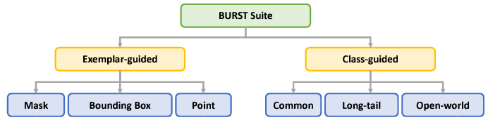
</p>

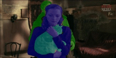 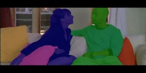 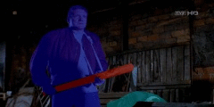 
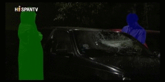 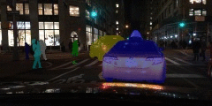   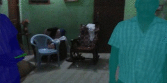
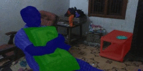   
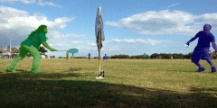 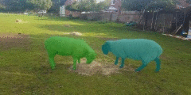  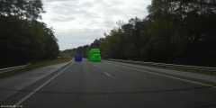
 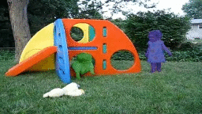
<!--
 
-->

### Updates

* **27-03-2023:** STCN tracker baseline is available.
* **24-11-2022:** Evaluation code is now available.
* **24-09-2022:** Dataset annotations are public.

### Abstract

> Multiple existing benchmarks involve tracking and segmenting objects in video e.g., Video Object Segmentation (VOS) and Multi-Object Tracking and Segmentation (MOTS), but there is little interaction between them due to the use of disparate benchmark datasets and metrics (e.g. J&F, mAP, sMOTSA). As a result, published works usually target a particular benchmark, and are not easily comparable to each another. We believe that the development of generalized methods that can tackle multiple tasks requires greater cohesion among these research sub-communities. In this paper, we aim to facilitate this by proposing BURST, a dataset which contains thousands of diverse videos with high-quality object masks, and an associated benchmark with six tasks involving object tracking and segmentation in video. All tasks are evaluated using the same data and comparable metrics, which enables researchers to consider them in unison, and hence, more effectively pool knowledge from different methods across different tasks. Additionally, we demonstrate several baselines for all tasks and show that approaches for one task can be applied to another with a quantifiable and explainable performance difference.

**NOTE:** The annotations in this dataset are not exhaustive i.e. not every object belonging to the dataset class set is annotated. We do, however, provide two fields per video which convey (1) which classes are present but not exhaustively annotated, and (2) which classes are definitely not present in the video. This follows the format of the LVIS dataset.

## Dataset Download

- Image sequences: Available from the [MOTChallenge website](https://motchallenge.net/tao_download.php).
- Annotations: Available from [RWTH omnomnom](https://omnomnom.vision.rwth-aachen.de/data/BURST/annotations.zip)

The annotations are organized in the following directory structure:

```
- train:
  - all_classes.json
- val:
  - all_classes.json
  - common_classes.json
  - uncommon_classes.json
  - first_frame_annotations.json
- test:
  - all_classes.json
  - common_classes.json
  - uncommon_classes.json
  - first_frame_annotations.json
- info:
  - categories.json
  - class_split.json
```

For each split, `all_classes.json` is the primary file containing all mask annotations. The others are a sub-set of those: `common_classes.json` and `uncommon_classes.json` only contain object tracks belonging to the corresponding class split (see `class_split.json`). The `first_frame_annotations.json` file is relevant only for the exemplar-guided tasks since it contains the annotations for each object track in only the first frame where it occurs. This can be easily deduced from the primary annotations file as well, but we provide it separately for ease of use.

**NOTE:** In contrast to other datasets, we have decided to make the test set annotations public. Remember though: with great power comes great responsibility. Please use the test set fairly when reporting scores for your methods.

## Parsing and Visualization

Please refer to `burstapi/dataset.py` for example code to parse the annotations.

Assuming the images and annotation files are downloaded, you can visualize the masks by running the following:

```
python burstapi/demo.py --images_base_dir /path/to/dataset/images --annotations_file /path/to/any/of/the/annotation/files
```

- `--images_base_dir` should have three sub-folders in it: `train`, `val` and `test` with the images for each of those splits.
- When running the demo script for one of the `first_frame_annotations` files, also include an additional `--first_frame_annotations` argument to the above command. The demo script will then also show the first-frame exemplar point.


## Evaluation

The evaluation code has been integrated into the [TrackEval](https://github.com/JonathonLuiten/TrackEval) repository. You can either set up the directory structure required by TrackEval yourself, or you can use the wrapper API provided in this repo in `burstapi/eval` as follows:

Your results should be in a single JSON file in the same format as the ground-truth (see [annotation format](ANNOTATION_FORMAT.md)). Then you can call the eval script by running:

```
bash burstapi/eval/run.sh --pred /path/to/your/predictions.json --gt /path/to/directory/with/gt_annotations --task {class_guided,exemplar_guided,open_world}
```

For this to work, you need to clone the TrackEval repo and set the environment variable `TRACKEVAL_DIR` to its path.

**Frame-rate:** The val and test sets are evaluated at 1FPS. The eval code can handle result files with arbitrary frame rates (the predicted masks for un-annotated frames are simply ignored).

**Additional Details:** This bash script creates a temporary directory and copies the provided predictions and ground-truth files there before calling the eval scripts for BURST in TrackEval. The three exemplar-guided tasks share the same evaluation procedure, as do the common and long-tail class-guided tasks. For the open-world tracking task, the internal TrackEval script is actually executed three times for the different class splits and the results for each run are printed separately.

## Baselines

See `baselines/README.md`

## Cite

```
@inproceedings{athar2023burst,
  title={BURST: A Benchmark for Unifying Object Recognition, Segmentation and Tracking in Video},
  author={Athar, Ali and Luiten, Jonathon and Voigtlaender, Paul and Khurana, Tarasha and Dave, Achal and Leibe, Bastian and Ramanan, Deva},
  booktitle={WACV},
  year={2023}
}
```
