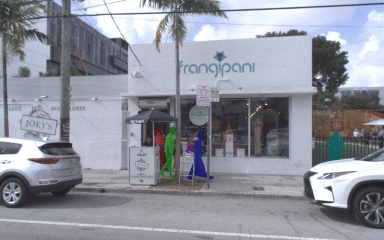
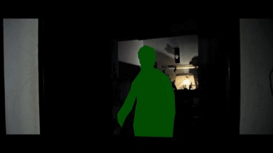
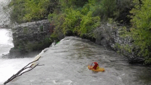

# BURST: A Benchmark for Unifying Object Recognition, Segmentation and Tracking in Video

### TL;DR

BURST is a dataset/benchmark for object segmentation in video. It contains a total of 2,914 videos with pixel-precise segmentation masks for 16,089 unique object tracks (600,000 per-frame masks) spanning 482 object classes.

|   |  |
|   |   |

### Abstract

Multiple existing benchmarks involve tracking and segmenting objects in video e.g., Video Object Segmentation (VOS) and Multi-Object Tracking and Segmentation (MOTS), but there is little interaction between them due to the use of disparate benchmark datasets and metrics (e.g. J&F, mAP, sMOTSA). As a result, published works usually target a particular benchmark, and are not easily comparable to each another. We believe that the development of generalized methods that can tackle multiple tasks requires greater cohesion among these research sub-communities. In this paper, we aim to facilitate this by proposing BURST, a dataset which contains thousands of diverse videos with high-quality object masks, and an associated benchmark with six tasks involving object tracking and segmentation in video. All tasks are evaluated using the same data and comparable metrics, which enables researchers to consider them in unison, and hence, more effectively pool knowledge from different methods across different tasks. Additionally, we demonstrate several baselines for all tasks and show that approaches for one task can be applied to another with a quantifiable and explainable performance difference.

